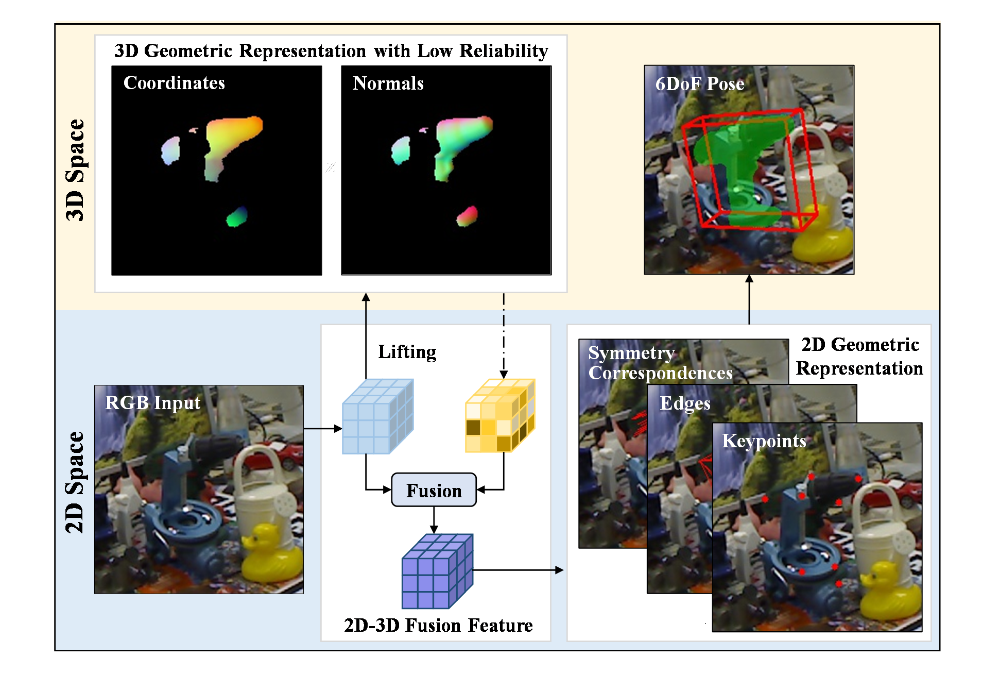

# MLFNet: Monocular Lifting Fusion Network for 6DoF Texture-less Object Pose Estimation
This repository contains authors' implementation of MLFNet: Monocular Lifting Fusion Network for 6DoF Texture-less Object Pose Estimation. Our implementation is based on [HybridPose](https://github.com/chensong1995/HybridPose).


## Introduction
MLFNet lifts the feature space from 2D to 3D based on hybrid 3D intermediate representations. With the proposed multi-modality dual attention mechanism and the embedding of standard 3D shape knowledge, the 2D geometric representation learning process explicitly depends on the fusion of 2D appearance features and 3D geometric features.



## Download
```
git clone --recurse-submodules git@github.com:JJJano/MLFNet.git
```

## Environment set-up
Please install [Anaconda](https://www.anaconda.com/distribution/) first and execute the following commands:
```
conda create -y --name mlfnet python==3.7.4
conda install -y -q --name mlfnet -c pytorch -c anaconda -c conda-forge -c pypi --file requirements.txt
conda activate mlfnet
```

## Compile the Ransac Voting Layer
The Ransac Voting Layer is used to generate keypoint coordinates from vector fields. Please execute the following commands (copied from [PVNet](https://github.com/zju3dv/pvnet)):
```
cd lib/ransac_voting_gpu_layer
python setup.py build_ext --inplace
```

## Compile the pose regressor
The pose regressor is written in C++ and has a Python wrapper. Please execute the following commands (copied from [HybridPose](https://github.com/chensong1995/HybridPose)):
```
cd lib/regressor
make
```

## Dataset set-up
Download the datasets from [PVNet repo](https://github.com/zju3dv/pvnet) and follow the folder structure of [HybridPose repo](https://github.com/chensong1995/HybridPose) to unzip them.

## Training
Please set the arguments in src/train\_core.py execute the following command (note that we need to set LD\_LIBRARY\_PATH for the pose regressor):
```
# on bash shell
LD_LIBRARY_PATH=lib/regressor:$LD_LIBRARY_PATH python src/train_core.py
# on fish shell
env LD_LIBRARY_PATH="lib/regressor:$LD_LIBRARY_PATH" python src/train_core.py
```
If you use a different shell other than bash and fish, prepend "lib/regressor" to LD\_LIBRARY\_PATH and run `python src/train_core.py`.

Running `src/train_core.py` now will save both ground truth and predicted poses to a directory called `output`.

## Evaluation
To evaluate accuracy of predicted poses, please set the arguments in `src/evaluate.py` and run
```
python src/evaluate.py
```

## Citation
The corresponding paper has been submitted to Neurocomputing:
```
@misc{jiang2021mlfnet,
    title={MLFNet: Monocular Lifting Fusion Network for 6DoF Texture-less Object Pose Estimation},
    author={Junjie Jiang and Zaixing He and Xinyue Zhao and Shuyou Zhang and Chenrui Wu and Yang Wang},
    year={2021},
    primaryClass={cs.CV}
}
```
